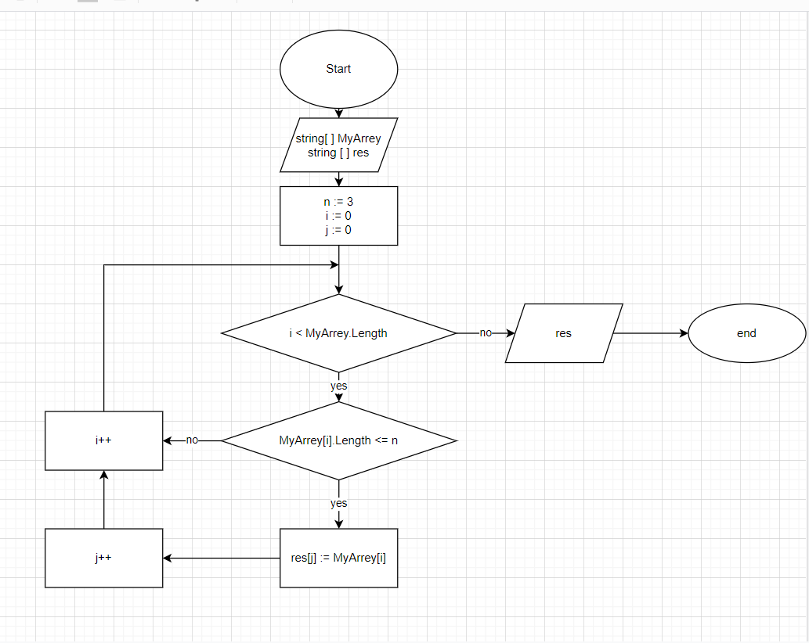

# ***Итоговая работа:***

## Задача:

*Написать программу, которая из имеющегося массива строк формирует новый массив из строк, длина которых меньше, либо равна 3 символам. Первоначальный массив можно ввести с клавиатуры, либо задать на старте выполнения алгоритма. При решении не рекомендуется пользоваться коллекциями, лучше обойтись исключительно массивами.*

## Решение:

**1.** Задаём случайный массив

**2.** Ищем строки в которых 3 или меньше символов и задаём размер конечного массива

**3.** Задаём конечный массив в который вводим подходящие строки из начального массива

**4.** Выводим оба массива

## Блок-схема решения:

